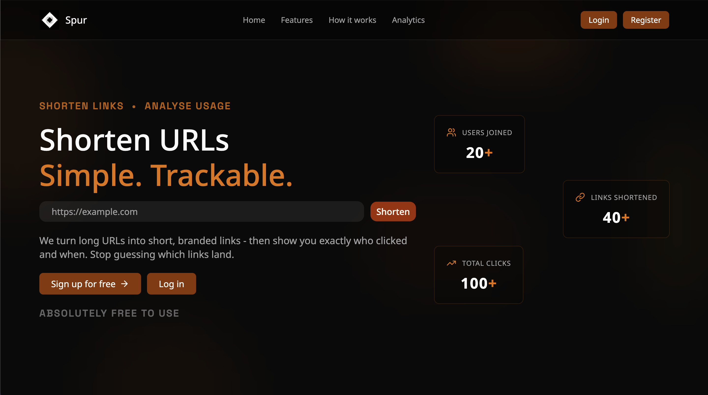

# Spur
A modern URL shortener built with **FastAPI**, **PostgreSQL**, and **React**.
Create short links, track clicks, manage URLs from a dashboard, and analyze usage through interactive charts.

## Demo
[](https://raw.githubusercontent.com/losthread/spur/main/frontend/public/tut.mp4)
*Click the image above to download and watch the demo video.*

## Features
- Shorten URLs instantly
- Update long URLs without changing the short URL
- Delete URLs from your dashboard
- Analytics dashboard
- Weekly click tracking chart
- Total click counts per link

### Backend Stack
- FastAPI
- PostgreSQL
- Psycopg2
- JWT Authentication
- Argon2 Password Hashing
- Google OAuth

### Frontend Stack
- React
- Vite
- Tailwind CSS
- shadcn/ui

## Installation
1. Clone repo:
```bash
git clone https://github.com/losthread/spur.git
cd spur
```

2. Configure environment:

Create `.env` in project root:
```env
DATABASE_URL=your_db_url
JWT_KEY=your_secret_key
GOOGLE_CLIENT_ID=your_google_client_id
GOOGLE_CLIENT_SECRET=your_google_client_secret
```

Create `.env` in project frontend folder:
```env
VITE_GOOGLE_CLIENT_ID=your_vite_google_client_id
VITE_API_URL=http://localhost:8000
```

3. Run with Docker Compose:
```bash
docker-compose up --build
```

4. Access the app:
All three services (Frontend, Backend, PostgreSQL) are orchestrated by docker compose and will start automatically.

## Manual Setup (without Docker)

### Backend Setup
```bash
cd backend
python -m venv venv
# macOS/Linux
source venv/bin/activate
# Windows
venv\Scripts\activate
pip install -r requirements.txt
```

Create `.env` in project's root:
```env
DATABASE_URL=your_db_url
JWT_KEY=your_secret_key
GOOGLE_CLIENT_ID=your_google_client_id
GOOGLE_CLIENT_SECRET=your_google_client_secret
```

Create `.env` in project's frontend folder:
```env
VITE_GOOGLE_CLIENT_ID=your_vite_google_client_id
VITE_API_URL=http://localhost:8000
```

Run the backend:
```bash
uvicorn app.main:app --reload
```

Backend will run at:
```text
http://localhost:8000
```

### Frontend Setup
```bash
cd frontend
npm install
npm run dev
```

Frontend will run at:
```text
http://localhost:5173
```

### Authentication
```http
POST /register
POST /login
POST /login/google
```

### URLs
```http
POST   /shorten
GET    /go/{short_code}
PUT    /shorten/{short_code}
DELETE /shorten/{short_code}
```

### User
```http
GET /users/me
GET /users/me/urls
```

### Analytics
```http
GET /analytics
```

## Future Improvements
- Email verification
- Password reset flow
- Custom short codes
- Geographic click analytics

## License
MIT

### Project Reference
https://roadmap.sh/projects/url-shortening-service